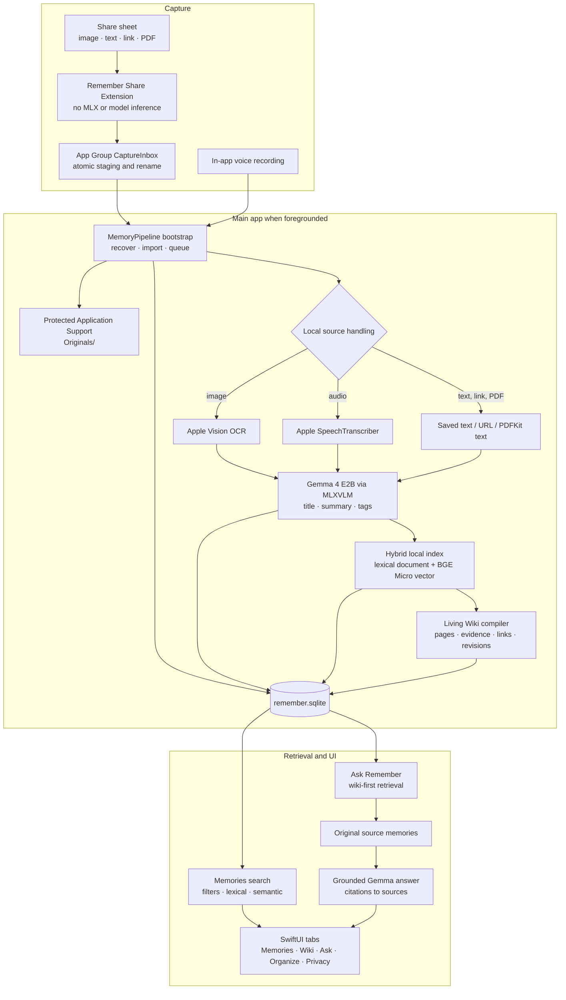

# Remember

> A private, fully on-device memory assistant for iPhone that turns saved images, links, PDFs, text, and voice notes into a searchable, source-grounded personal knowledge base.

Remember is an iOS “second brain” built around an explicit privacy boundary: users choose what to save, and the app captures, transcribes, understands, indexes, retrieves, and organizes that content locally. There is no account, cloud sync, hosted inference, or application networking path in the current implementation.

The project is a working development prototype. It includes the main SwiftUI app, a low-memory Share Extension, local Gemma 4 and BGE Micro inference through MLX, protected SQLite storage, hybrid search, Ask Remember, and an additive Living Wiki.

## What is implemented

- Share images, photos, text, web links, and PDFs from other apps.
- Record and play voice memories in the app, with transcription by an already-installed Apple on-device speech model.
- Extract image text with Apple Vision and text from compatible PDFs with PDFKit.
- Generate a title, factual summary, and tags with the local Gemma 4 E2B multimodal model.
- Track every memory through `captured`, `processing`, `indexed`, and `failed` states, with retry and recovery for interrupted work.
- Browse a reverse-chronological visual library and edit or delete individual memories.
- Search locally by text, type, date, and tag; submitted semantic searches combine BGE Micro vectors, exact matching, and Gemma-generated query expansions.
- Ask questions about saved material and receive a concise Gemma answer with tappable citations to original memories.
- Automatically compile indexed memories into a Living Wiki of projects, concepts, decisions, constraints, and open questions, including evidence, links, revisions, and contradictions.
- Create non-owning collections and rename or delete tags across the library.
- Inspect a content-free local AI activity log covering transcription, analysis, semantic search, chat, and wiki compilation.
- Disable the Living Wiki at runtime and return to the original Memories, Ask, Organize, and Privacy experience without deleting wiki data.

## How the system works



The two-stage share flow is intentional. iOS Share Extensions have a much smaller memory budget than the main app, so the extension only performs a fast, atomic write into the shared App Group. The main app acknowledges the capture only after the original has been copied into protected app-local storage and its SQLite record has been durably inserted.

## Under the hood

### Capture and persistence

`CaptureInbox` is the only capture wire format shared by the app and extension. Each capture is written into a hidden staging directory and atomically renamed when its payload and metadata are complete. On foreground activation, `CaptureImporter` moves the payload into `Application Support/Remember/Originals` and inserts a record into `remember.sqlite`. Stable UUIDs make retries idempotent and prevent duplicate imports.

The App Group (`group.SimpleStudio.Remember`) is only a temporary inbox. Long-term originals, indexes, wiki data, collections, and activity records live in the main app container with `completeUntilFirstUserAuthentication` file protection.

### Local analysis

Source preprocessing depends on memory type:

| Source | Local preprocessing | Gemma input |
| --- | --- | --- |
| Image or screenshot | Accurate Apple Vision OCR | Original image, OCR, and optional user note |
| Voice recording | Installed Apple `SpeechTranscriber` model | Local transcript |
| Text | Local UTF-8 read | Saved text |
| Link | URL stored as text; the page is never fetched | Saved URL and note |
| PDF | PDFKit text extraction | Extracted text and note |

Gemma returns strict JSON containing a short title, summary, and tags. Deterministic parsing bounds fields, removes duplicate tags, handles Markdown-wrapped output, and falls back to source text when output is malformed. Model generation is deterministic and all model families share `GemmaExecutionGate`, so large Gemma and BGE instances are never intentionally resident at the same time.

### Search and Ask Remember

Every indexed memory has a bounded lexical document and, when embedding succeeds, a normalized 384-dimensional BGE Micro vector. Instant typing uses the local lexical index only. An explicitly submitted semantic query lets Gemma expand the wording, embeds the original query with BGE Micro, and ranks results using semantic similarity plus phrase, token, title, and tag signals. Filtering happens locally before results are returned.

Ask Remember searches Living Wiki pages first, follows their evidence links back to immutable source memories, and falls back to raw-memory hybrid retrieval when needed. Gemma receives wiki synthesis as navigation context but must support its answer from the original memories; visible citations always open those sources. If retrieval finds no evidence, the app returns a deterministic not-found response without loading Gemma.

### Living Wiki

The Living Wiki is a derived, reversible layer over the original library. Once a memory is indexed, a retry-safe queue finds a bounded set of candidate pages using BGE similarity, titles, aliases, lexical overlap, and one graph hop. Gemma proposes a JSON patch, while deterministic Swift code validates page types, field lengths, candidate UUIDs, links, provenance, and source versions before one transaction writes the result.

The wiki maintains current pages separately from source evidence, graph links, append-only revisions, compilation state, and its own search index. Conflicting information becomes a visible `contradicted` revision instead of silently replacing history. Turning the feature off hides the Wiki tab and stops future compilation; it does not alter the original memory workflow or delete existing wiki data.

### Privacy and memory management

- The current code contains no application networking feature or remote inference fallback.
- No captured content, prompts, OCR, transcripts, images, or generated answers are written to the activity log.
- The Privacy tab reports implemented app behavior and content-free operation metadata. It does not claim to be a packet monitor; iOS does not expose a complete per-app live packet log to the app itself.
- The Share Extension does not link or load MLX.
- Gemma is loaded from a bundled local directory for each operation, released afterward, and followed by an MLX cache clear. This is slower than keeping the model warm but reduces idle and cumulative memory pressure.
- BGE uses the same execution gate, an 8 MiB MLX cache limit, and a 256-token cap.
- The main target enables Apple’s Increased Memory Limit entitlement; the Share Extension intentionally does not.

## Technology

- SwiftUI and Observation for the interface and app state
- Swift actors for pipeline, database, model, and queue isolation
- GRDB 7.11.1 and SQLite for durable local storage and migrations
- MLX Swift 0.31.6 for Metal-backed on-device inference
- `mlx-swift-lm` pinned to revision `68947ccdca79bcf7a26dc220f73caa060369513c`
- Gemma 4 E2B 4-bit, pruned to the text-and-vision tensors used by the app
- `TaylorAI/bge-micro-v2` for local 384-dimensional English text embeddings
- Apple Vision, Speech, AVFoundation, PDFKit, and ImageIO

Package versions are locked in `Remember/Remember.xcodeproj/project.xcworkspace/xcshareddata/swiftpm/Package.resolved`.

## Requirements

- macOS with an Xcode version that includes the iOS 26.5 SDK
- A physical iPhone that supports the Increased Memory Limit entitlement for real Gemma inference testing
- An Apple Development team with an App Group configured for both the app and Share Extension
- Approximately 3 GB of local space for the development Gemma bundle, plus the BGE model and build products
- An installed on-device Dictation language matching the device locale for voice transcription
- Local model directories at:

  ```text
  ~/models/gemma-4-e2b-vision
  ~/models/bge-micro-v2
  ```

The simulator is useful for deterministic tests with injected model doubles, but it is not an equivalent validation environment for MLX Metal inference, the increased-memory capability, or live microphone transcription.

## Setup

1. Obtain the MLX-format Gemma 4 E2B 4-bit checkpoint and place the original at `~/models/gemma-4-e2b`.

2. Create the text-and-vision development bundle. The script streams the checkpoint, leaves the source unchanged, and removes only the unused `audio_tower.*` and `embed_audio.*` tensors:

   ```sh
   python3 scripts/prune_gemma4_for_ios.py \
     ~/models/gemma-4-e2b \
     ~/models/gemma-4-e2b-vision
   ```

3. Place a complete `TaylorAI/bge-micro-v2` MLX model directory at `~/models/bge-micro-v2`. The app validates its configuration, tokenizer, pooling configuration, and weights at runtime.

4. Open `Remember/Remember.xcodeproj` in Xcode. Select your development team and ensure the main app and Share Extension use the same App Group identifier. If you change the bundle identifiers, update the App Group entitlements and `RememberAppGroup.identifier` together.

5. Resolve Swift packages:

   ```sh
   xcodebuild -resolvePackageDependencies \
     -project Remember/Remember.xcodeproj \
     -scheme Remember
   ```

6. Select the **Remember** scheme—not `RememberShareExtension`—and run on a supported, unlocked physical iPhone. Keep the app foregrounded while the current prototype processes queued memories or compiles the wiki.

## Build and test

Build the app without code signing:

```sh
xcodebuild -quiet \
  -project Remember/Remember.xcodeproj \
  -scheme Remember \
  -configuration Debug \
  -destination 'generic/platform=iOS' \
  CODE_SIGNING_ALLOWED=NO \
  -skipPackagePluginValidation \
  -skipMacroValidation \
  build
```

Compile the app and test bundles:

```sh
xcodebuild -quiet \
  -project Remember/Remember.xcodeproj \
  -scheme Remember \
  -configuration Debug \
  -destination 'generic/platform=iOS' \
  CODE_SIGNING_ALLOWED=NO \
  -skipPackagePluginValidation \
  -skipMacroValidation \
  build-for-testing
```

`RememberTests.swift` currently contains 29 deterministic unit tests covering atomic capture, exactly-once import, state persistence, parser fallbacks, search and embeddings, filters, activity recovery, voice-memory handling, collections and tags, and Living Wiki retrieval and persistence. The UI test target contains launch scaffolding.

## Current limitations

- In-app typed-note and camera capture are not implemented; typed text, images, links, and PDFs currently enter through the Share Extension.
- Image-only/scanned PDFs are not rendered and OCRed; text-based PDFs work.
- Processing and wiki compilation are foreground-driven. Guaranteed background execution is not implemented.
- The large models are bundled from local development folders. A production first-launch download/install flow and progress UI are not implemented.
- Full-library export, delete-all tooling, and proactive resurfacing are not implemented. Individual memory deletion is available.
- BGE Micro is English-focused; multilingual retrieval quality is not promised.
- Reloading the approximately 2.8 GiB Gemma checkpoint for each operation can make analysis noticeably slow, but avoids keeping it resident while the user browses.

## Repository map

```text
.
├── PRD.md                         Product goals, constraints, and roadmap
├── implementation.md              Detailed implementation and acceptance notes
├── scripts/
│   └── prune_gemma4_for_ios.py    Removes unused audio tensors from the MLX checkpoint
└── Remember/
    ├── Remember/                  Main SwiftUI app, pipeline, models, search, wiki, and storage
    ├── Shared/                    Atomic App Group capture format
    ├── RememberShareExtension/    Share-sheet capture target
    ├── RememberTests/             Deterministic unit tests
    ├── RememberUITests/           UI test scaffolding
    └── Remember.xcodeproj/        Xcode project and pinned Swift package resolution
```

For deeper implementation details, database schema notes, runtime tradeoffs, and the physical-device acceptance checklist, see [`implementation.md`](implementation.md). For the original product scope and rationale, see [`PRD.md`](PRD.md).
