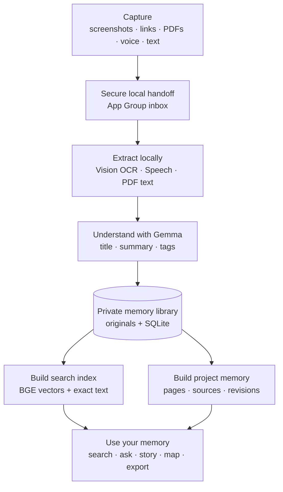
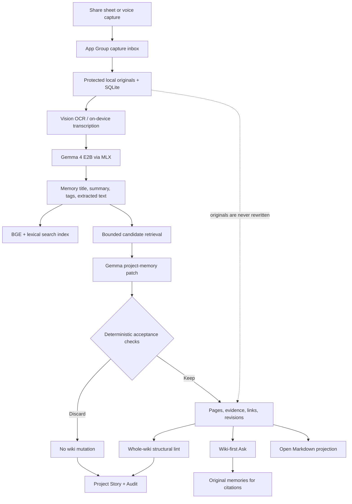

# Remember

Remember is a privacy-first **Private Project Memory** for iPhone. It turns the screenshots, links, PDFs, voice notes, photos, and text you deliberately save into a living, source-linked record of a project—without uploading the vault or running a hosted model.

The initial audience is solo founders, indie hackers, designers, and makers who repeatedly lose project context across camera rolls, chat threads, browser tabs, notes, and recordings. Remember is designed to answer a more specific question than “where did I save that?”:

> What does this project currently know, why did we make this choice, what changed, and what is still unresolved?

## Product principles

- **Private vault:** captured content, OCR, transcripts, embeddings, wiki pages, and inference remain on the iPhone.
- **Open engine and knowledge format:** the derived project memory can be exported as human-readable Markdown with stable IDs, sources, revisions, checks, and operation history. The user’s vault remains private unless they explicitly export it.
- **Inspectable AI changes:** Gemma proposes bounded patches. Deterministic code decides whether a patch is structurally safe to keep; the model does not grade itself.
- **Originals remain authoritative:** the Living Wiki is a derived layer. Saved memories are never rewritten by the compiler.
- **Reversible evolution:** disabling Living Wiki returns the app to the original v1 Memories, Ask, Organize, and Privacy experience without deleting wiki data.

“Open” here describes the software architecture and export format. A public source-code license still needs to be selected before publishing or redistributing the repository.

## What the app does

- Captures images, text, links, and PDFs through a low-memory Share Extension.
- Records voice notes and transcribes them with the installed on-device Apple Speech model.
- Uses Apple Vision OCR and local Gemma 4 E2B through MLX for titles, summaries, tags, image understanding, wiki compilation, query expansion, and grounded answers.
- Uses a bundled BGE Micro model for local semantic retrieval.
- Provides a searchable visual memory feed, filters, collections, editable metadata, and source-citing chat.
- Compiles durable knowledge into **Project Memory**, a Living Wiki with a project-specific schema.
- Surfaces project evolution through the prominent **Project Story** entry point, a tappable source-to-page timeline, and **Knowledge Map**, while retaining the complete technical ledger under **Audit**.
- Suggests Ask questions from the user's actual Project Memory pages instead of relying only on generic examples.
- Exports the derived project memory and chronological ledger as portable Markdown.

## System at a glance

Remember has one simple loop: save useful project context, understand it privately on the iPhone, organize it into durable memory, and bring it back when needed.

Captured originals stay private and authoritative throughout this flow. The app builds searchable memories and project knowledge around them without uploading or rewriting them.

## Detailed architecture

The Share Extension never links or loads MLX. It only performs an atomic handoff, then exits. The main app processes one item at a time and serializes BGE and Gemma execution to stay below the physical iPhone memory ceiling.

## Private Project Memory program

The current program is versioned as `private-project-memory-v1`. It asks the compiler to preserve durable project state using this visible schema:

| Page type | Purpose |
| --- | --- |
| Project | Ongoing effort, objective, and current state |
| Decision | A choice or serious proposal, including its reasoning |
| Constraint | Requirement, risk, dependency, budget, or boundary |
| Experiment | Bounded test with a hypothesis, method, observation, or result |
| Feedback | Actionable input from a user, reviewer, customer, or collaborator |
| Person | A person whose role, expertise, commitment, or relationship matters |
| Open Question | An unresolved issue that affects later work or decisions |
| Reference | Durable supporting knowledge that does not fit another type |

Every source memory is compared with at most eight locally retrieved candidate pages. Gemma may propose at most three concise, high-value changes. Candidate identifiers and cross-links must come from that bounded set. If Gemma's first response is malformed, one bounded on-device repair turn asks it to emit compact JSON; deterministic validation still controls what can be written.

### Protected evaluator

Before a patch is applied, deterministic checks enforce:

- maximum patch size;
- candidate-ID scope;
- source-grounded required fields;
- one proposed change per canonical page;
- no self-links.
- obvious page-type mismatches are filtered;
- semantically equivalent proposals are redirected to an existing page or consolidated.

After a foreground compilation batch, a deterministic lint checks source traceability, revision consistency, exact and likely semantic duplicates, link integrity, and reports graph connectedness as informational context. Lint is read-only.

Project Story turns those records into a narrative timeline; Knowledge Map draws explicit links and shared-evidence relationships; Audit retains the reproducible check ledger. The ledger stores evidence and operational rationale, not hidden chain-of-thought. Older Living Wiki revisions remain readable but naturally predate it.

## Open Markdown projection

From **Project Memory → menu → Export open Markdown**, Remember creates one `.md` document containing:

- format and program versions;
- a page index grouped by schema type;
- current page summaries, aliases, connections, and stable IDs;
- original-memory IDs/titles/dates used as evidence;
- chronological before/after revision history;
- compiler/lint runs, model and prompt versions, protected checks, and keep/discard results.

The projection deliberately does not embed original photos, PDFs, audio, or the SQLite database. It is a portable knowledge view, not a full-vault backup.

## Repository layout

- `PRD.md` — original product requirements and constraints.
- `implementation.md` — detailed high- and low-level implementation record, validation, and device acceptance steps.
- `Remember/Remember/` — SwiftUI app, local pipelines, database, retrieval, Living Wiki, Project Story/Map/Audit, and export.
- `Remember/RememberShareExtension/` — low-memory Share Extension target.
- `Remember/Shared/` — atomic App Group capture format shared by the app and extension.
- `Remember/RememberTests/` — deterministic unit and persistence tests.
- `scripts/` — local model-preparation tooling.

Model weights and build products are intentionally excluded from version control.

## Development setup

The Xcode project currently references development-only local folders:

- `~/models/gemma-4-e2b-vision`
- `~/models/bge-micro-v2`

The Gemma vision checkpoint is derived locally from the original download by `scripts/prune_gemma4_for_ios.py`; the script removes unused audio tensors without downloading replacement weights. See `implementation.md` for exact model/runtime details and the reason for the pinned `mlx-swift-lm` revision.

In Xcode:

1. Open `Remember/Remember.xcodeproj`.
2. Select the **Remember** app target and your Apple Developer Team.
3. Confirm the app target has the App Group `group.SimpleStudio.Remember` and **Increased Memory Limit** capabilities.
4. Confirm the Share Extension target has the same App Group, but not Increased Memory Limit.
5. Select the **Remember** scheme and a supported physical iPhone, then run. Gemma inference is intentionally tested on-device, not treated as validated by the simulator.

For the complete physical-device acceptance flow, see `implementation.md`.

## Current limitations

- Model bundles are development-time Xcode resources; production first-launch model installation is not implemented.
- Compilation is foreground-driven because iOS background execution is opportunistic.
- The Markdown projection is not yet a full binary vault backup or delete-all workflow.
- In-app typed note/camera capture, scanned-PDF OCR, proactive resurfacing, and bounded AutoLab prompt experiments remain future work.
- The current small English-focused models require conservative prompts, small candidate sets, and deterministic gates; Remember does not attempt unbounded autonomous research on the phone.
